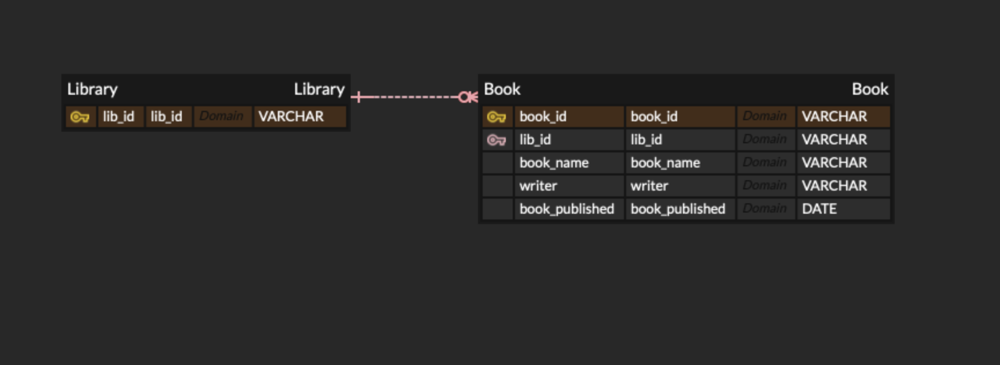
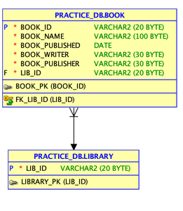

### ERD

#### 잘못 설계했다
- 책은 도서관과 독립적으로 존재 해야한다.
- 대여 된 책으로 생성 해야 자연스러울 것 같다.
### 직접 구현한 테이블
> 
>   
> ### 수정 
> 
> 
> lib_id 를 식별자로 book_table을 생성했다.
> 
> 한 도서관에는 여러권의 책이 존재 하거나 없을 수 있으므로 일대 다 관계로 생성 했다.
> ### 책은 도서관과 독립적으로 존재 해야한다.
> 
> 

#### 엔티티 상태
##### LIBRARY
- `강한 엔티티` : 
  - 독립적으로 존재
  - 엔티티 내에서 자체 식별자를 사용하여 고유하게 인스턴스 식별 가능
- `독립 엔티티` : 사람, 물건 처럼 원래 현실에 존재하는 엔티티
- `핵심 엔티티` : 부모 엔티티를 갖지 않는 독립적이며 핵심적인 엔티티
##### BOOK
- `강한 엔티티` :

    - 독립적으로 존재

    - 엔티티 내에서 자체 식별자를 사용하여 고유하게 인스턴스 식별 가능

- `독립 엔티티` : 사람, 물건 처럼 원래 현실에 존재하는 엔티티

- `핵심 엔티티` : 부모 엔티티를 갖지 않는 독립적이며 핵심적인 엔티티

#### 관계
- 책과 도서관은 서로 독립적인 관계
 
