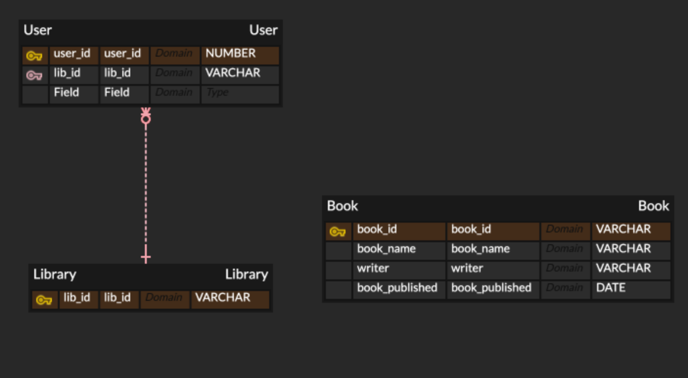

> 
> 도서관 이용자는 도서관과 다대일 관계를 갖고 고유한 아이디를 갖는다.
>  
> 도서관 이용자는 도서관 아이디로 식별 가능해야 한다.
>  
> 도서관 이용자는 직원 일 수도 있다 (포괄적)

### User 엔티티
- 일대다 관계 : 도서관 하나에 여러명의 이용자가 존재 할 수 있다.
- 실체 엔티티 : 눈으로 볼 수 있는 물리적인 형테를 가지는 엔티티
- 핵심 엔티티 : 부모 엔티티를 갖지 않는 독립적인 엔티티
- 독립 엔티티 : 원래부터 현실에 존재하는 엔티티
- 강한 엔티티 : 독립적으로 존재, 자체 식별자를 사용하여 고유하게 인스턴스 식별 가 